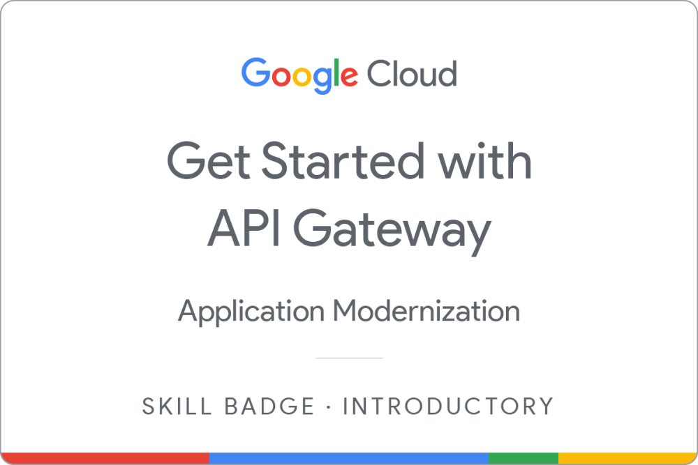
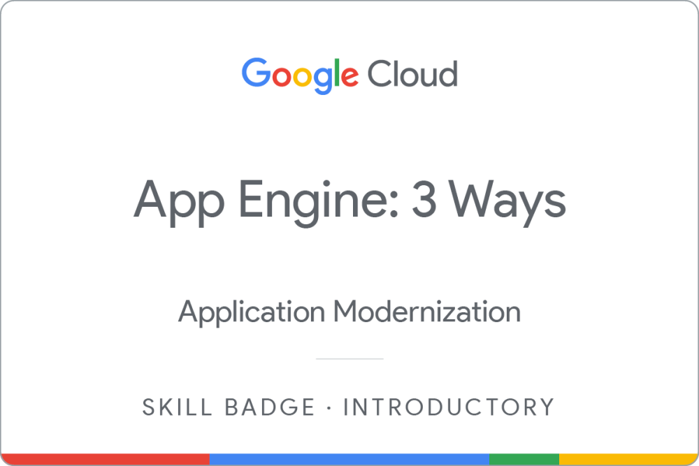

<h1 >Hi, I'm Nayan Jain 👋</h1>

  <h3>IT Student | Full Stack Developer | Cloud & Cybersecurity Enthusiast</h3>
  
  <!-- Add your Banner/GIF here -->
  <!--  -->
  
  

---

## 👨🏻‍💻 About Me

I am an Information Technology student focused on full stack web development, backend systems, and practical application building. 

My projects primarily involve real-world web applications, authentication systems, REST APIs, and cloud-integrated workflows.

Alongside development, I actively explore Google Cloud technologies, cybersecurity fundamentals, and secure coding practices through hands-on experimentation.

---

## 🛠️ Technical Arsenal

  
<b>Languages</b>

  &nbsp;
  &nbsp;
  &nbsp;
  
  
  
<b>Frontend Frameworks</b>

  &nbsp;
  &nbsp;
  &nbsp;
  &nbsp;
  
  
  
<b>Backend & Cloud</b>

  &nbsp;
  &nbsp;
  &nbsp;
  &nbsp;
  &nbsp;
  &nbsp;
  &nbsp;
  &nbsp;
  &nbsp;
  
  
<b>Tools & Deployment</b>

  &nbsp;
  &nbsp;
  &nbsp;
  &nbsp;
  &nbsp;
  

---

## Featured Projects

### CampusBook
A full stack campus-focused platform designed to book facility, manage venue availability and analytics smoothly.

  
  
  
  

| Key Features | Project Links |
| :--- | :--- |
| • JWT-based authentication and authorization • Full stack architecture with MongoDB integration • Responsive UI with analytics and dashboard components |  &nbsp;  |

---

### ElectGuide AI
An interactive AI-powered web assistant developed for election process education during PromptWars by Google/H2S.

  
  
  
  
  

| Key Features | Project Links |
| :--- | :--- |
| • Gemini API integration for interactive assistance • Google Cloud Run deployment with Docker containerization • Firestore-based analytics and logging |  &nbsp;  |

---

### RaktSetu — Social Impact Project (Devsprint Hackathon)
A blood donor connection platform designed to help connect donors and recipients efficiently.

  
  
  

| Key Features | Project Links |
| :--- | :--- |
| • Donor-recipient connection workflow • Firestore database integration • Responsive frontend with Gemini-assisted features |  &nbsp;  |

---

## 📚 Currently Learning & Exploring

* **Cybersecurity & Networking:** CS50's Introduction to Cybersecurity, TryHackMe fundamentals, network layers, and secure authentication systems.
* **Cloud & Architecture:** Google Cloud ecosystem, containerized deployments, and API Gateway configurations.
* **Backend Systems:** Java programming, robust application security basics, and scalable server architecture.

  
  
  
  
  

---

## 🎖 Certifications & Profiles

* **Google Cloud Arcade:** 2025 Trooper tier achiever & 2026 participant. Check out my [Credly Profile](https://www.credly.com/users/nayan-jain.05874f38).

#### Selected Google Cloud Badges

| Google Cloud Compute | Cloud Storage | API Gateway | App Engine | Monitoring in Google Cloud | GenAI Apps with Gemini & Streamlit |
| :---: | :---: | :---: | :---: | :---: | :---: |
|  |  |  |  |  |  |

 

* **Competitive Coding Profiles:** &nbsp;  &nbsp;  &nbsp; 

---

## Open Source & Community

Exploring open source contributions and collaborative development while continuing to build practical projects and strengthen technical foundations.

---

## 📈 GitHub Statistics

  
  

---

## 🌐 Connect With Me

  &nbsp;&nbsp;
  &nbsp;&nbsp;
  &nbsp;&nbsp;
  &nbsp;&nbsp;
  

  <i>Building, learning, and improving. I am open to collaboration and technical discussions!</i>  
  <b>Feel free to connect or explore my repositories.</b>

 

  
    
  <small>⭐ Star my repositories if you find them useful!</small>

